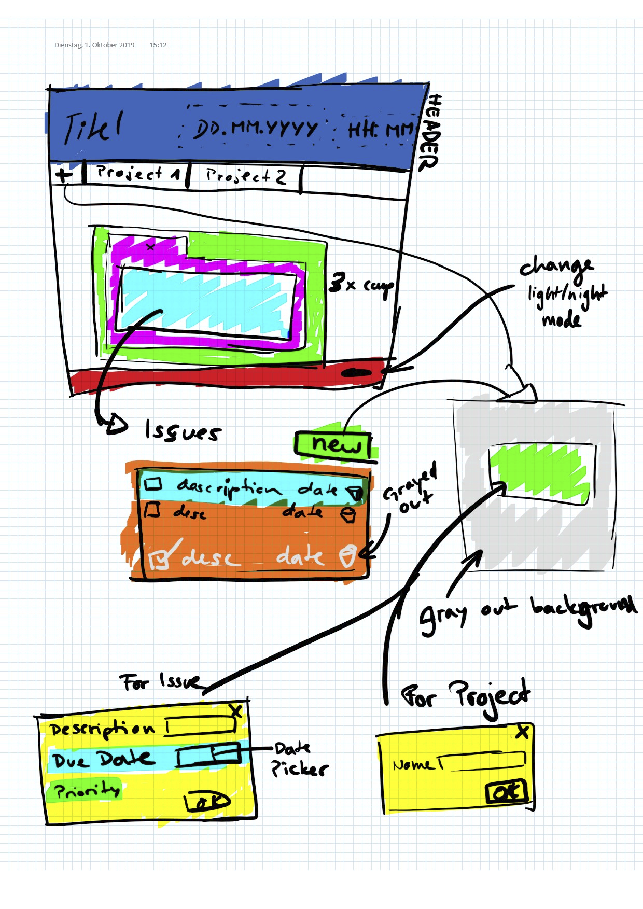

# WEB3 ZHAW Project

Project repository for the graded assignment of WEB3

# Get started with React project `yet-another-issue-tracker`

```shell
npm install
npm start # Start server on localhost:3000
```

Runs the app in the development mode.<br>
Open [http://localhost:3000](http://localhost:3000) to view it in the browser.

The page will reload if you make edits.<br>
You will also see any lint errors in the console.

## Deploy to heroku

Install Heroku cli: https://devcenter.heroku.com/articles/heroku-cli#download-and-install

credentials can be found in slack: https://zhaw-web3-project.slack.com/files/TNZ5MRP8F/FQTJN84SX

```shell
# login to heroku using credentials from above
heroku login

# either do: deploy a specific branch to heroku "master"
git push heroku develop:master

# or do: deploy master to heroku master
git push heroku master

# open website
heroku open
```
### Deployment URL “yet-another-issue-tracker” 
URL: https://yet-another-issue-tracker.herokuapp.com/

### `npm run build`

Builds the app for production to the `build` folder.<br>
It correctly bundles React in production mode and optimizes the build for the best performance.

The build is minified and the filenames include the hashes.<br>
Your app is ready to be deployed!

See the section about [deployment](https://facebook.github.io/create-react-app/docs/deployment) for more information.

## run tests

```shell
npm test
```
mLaunches the test runner in the interactive watch mode.<br>
See the section about [running tests](https://facebook.github.io/create-react-app/docs/running-tests) for more information.

# Mockup & Components



## Dark mode

css is set using a useState variable called `darkModeActive`. Upon change it saves its state to the local storage.
The state is passed to every component, which can then implement it if they want.
One example of such an implementation would be our Footer:

```js
<footer className={"Footer".concat(props.darkMode ? " FooterDarkMode" : " FooterLightMode")}>
```
The footer element then contains the classNames `Footer` and either `FooterDarkMode` or `FooterLightMode`.
Please note the space infront of the 2nd class name. This is needed or you'll end up with a className like `FooterFooterDarkMode`.

And this is the corresponding css.

```css
.FooterDarkMode {
    background-color: #A4A4A4;
    color: #4B4B4B;
}

.FooterLightMode {
    background-color: rgba(168, 168, 168, 0.1);
    color: #757575;
}
```

# Learning React

* [React Docs](https://create-react-app.dev/docs/documentation-intro)

### Tutorials

* [React Tutorial 1: How to Get Started and How it Compares](https://www.toptal.com/react/react-tutorial-pt1)
* [React Tutorial 2: Components, Hooks, and Performance](https://www.toptal.com/react/react-tutorial-pt2)
* [Tutorial: Intro to React](https://reactjs.org/tutorial/tutorial.html)
* [https://fullstackopen.com](https://fullstackopen.com/en/part0)

### More specific articles

* [Functional vs Class-Components in React](https://medium.com/@Zwenza/functional-vs-class-components-in-react-231e3fbd7108)
* [react-function-component](https://www.robinwieruch.de/react-function-component)
* [local-storage-react](https://www.robinwieruch.de/local-storage-react)
* [hooks-intro](https://reactjs.org/docs/hooks-intro.html)


# Create React App
This project was bootstrapped with [Create React App](https://github.com/facebook/create-react-app).
