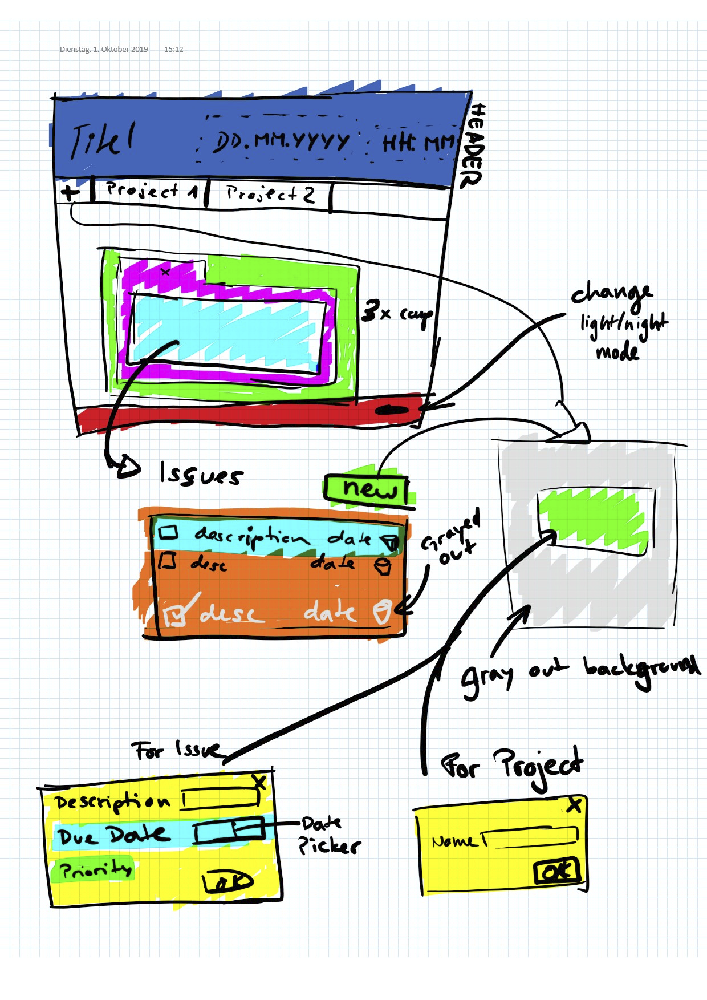

# WEB3 ZHAW Project

Project repository for the graded assignment of WEB3

# Get started with React project `issue-tracker`

```shell
cd issue-tracker
yarn install
yarn start # Start server on localhost:3000
```
## Add dependencies like
### Package: local-storage
https://www.npmjs.com/package/local-storage
```shell
yarn add local-storage --save
```
### Package: React-FontAwesome
https://github.com/FortAwesome/react-fontawesome
```shell
yarn add @fortawesome/fontawesome-svg-core
yarn add @fortawesome/free-solid-svg-icons
yarn add @fortawesome/react-fontawesome
```
### Install/Update packages/dependencies
Once added you should only run `yarn install` to update latest added packages

- Check also the [README.md](issue-tracker/README.md) inside the `issue-tracker` folder

# Mockup & Components



## Components: naming & css
#### Header
- Header { property: appTitle }
- Clock

#### Main
- Main
- Tab
- List

#### Footer
- Footer
- NightMode

#### Buttons
- Button
- AddButton
- CloseButton

#### Modal
- Modal
- DatePicker
- PrioritySelector
- TextInputField

css is set using a file name equal to the component name.
To enable light and dark switch mode, set the changing attributes in .css classes called:
<ComponentName>-light and <ComponentName>-dark, for example:

```css
.TextInputField-dark {
    background-color: rgba(65,62,62,0.9);
}

.TextInputField-light {
    background-color: rgba(242,241,241,1);
}
```

# Learning React

* [React Docs](https://create-react-app.dev/docs/documentation-intro)

### Tutorials

* [React Tutorial 1: How to Get Started and How it Compares](https://www.toptal.com/react/react-tutorial-pt1)
* [React Tutorial 2: Components, Hooks, and Performance](https://www.toptal.com/react/react-tutorial-pt2)
* [Tutorial: Intro to React](https://reactjs.org/tutorial/tutorial.html)
* [https://fullstackopen.com](https://fullstackopen.com/en/part0)
### More specific articles

* [Functional vs Class-Components in React](https://medium.com/@Zwenza/functional-vs-class-components-in-react-231e3fbd7108)
* [react-function-component](https://www.robinwieruch.de/react-function-component)
* [local-storage-react](https://www.robinwieruch.de/local-storage-react)
* [hooks-intro](https://reactjs.org/docs/hooks-intro.html)
